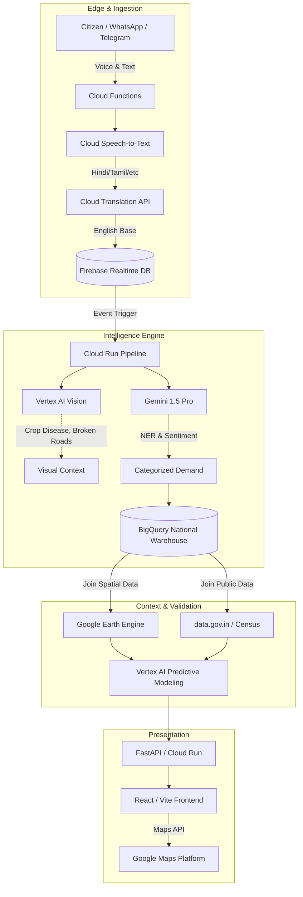

# Antim Rupee: Architecture Overview

Antim Rupee is a scalable, cloud-native platform built entirely on **Google Cloud Platform (GCP)**. It transforms fragmented, multilingual citizen feedback into structured, actionable intelligence for national infrastructure planning.

## System Diagram

## Layer 1: Ingestion & Multilingual Processing
Voice notes and texts are captured via messaging webhooks backed by **Cloud Functions**. **Cloud Speech-to-Text** (optimized for Indian dialects) and the **Translation API** normalize all inputs into structured English base text while preserving the original intent.

## Layer 2: Multimodal AI Extraction
**Gemini 1.5 Pro** performs entity extraction (location, infrastructure type, urgency). If the citizen uploaded photos (e.g., a broken water pipe), **Vertex AI Vision** validates the claim and severity.

## Layer 3: Geospatial & Predictive Aggregation
Normalized demands are stored in **BigQuery**. We join this unstructured demand with public datasets (Census, PM Gati Shakti) and satellite imagery via **Google Earth Engine**. **Vertex AI AutoML** is used to build predictive models that forecast future infrastructure demands based on historical hotspots.

## Layer 4: Real-time Policymaker Dashboard
The state dashboard is powered by a high-performance **React/Vite** frontend. **Google Maps Platform** is used to render interactive demand heatmaps, while the API layer serves recommendations calculated directly from BigQuery materialized views.
