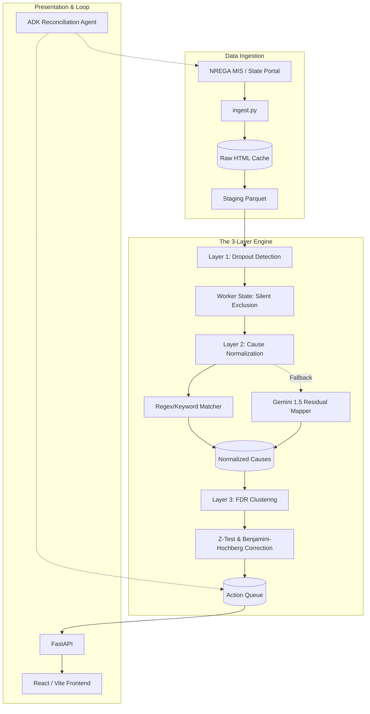

# Antim Rupee: Architecture Overview

Antim Rupee is built as a 4-layer data engine that transforms raw, messy banking failures into actionable, prioritized worklists for state agents.

## System Diagram

## Layer 1: Dropout Detection
Evaluates the 5-condition `silent_exclusion` rule across the worker panel to identify those trapped in the void between a rejected FTO and a non-existent grievance.

## Layer 2: Cause Normalization
Maps raw, unstandardized bank rejection strings into a strict taxonomy of 9 causes. Deterministic mapping covers ~91%, with Gemini invoked only for the long-tail residuals (with a strict enum JSON schema).

## Layer 3: Clustering & Worklist
Applies a Two-Proportion Z-Test to find significant clusters of failures (by block, by bank, by reason) against the district baseline. Uses Benjamini-Hochberg FDR correction to control for false positives.

## Agent Loop
An automated agent that verifies whether "Resolved" clusters resulted in actual FTO credits in the subsequent cycle. If resolution falls below the 80% threshold, the cluster is reopened and escalated.
