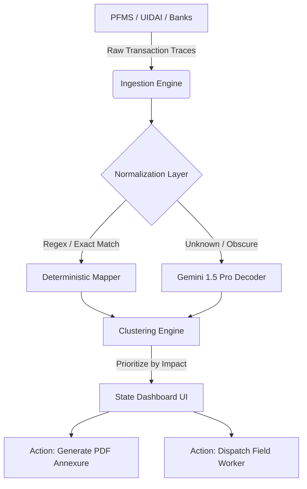

# Antim Rupee 🇮🇳
> **Empowering states to detect, analyze, and resolve stalled welfare payments instantly.**

## 🚨 The Problem: The "Silent Exclusion"
India’s Digital Public Infrastructure (DPI) processes billions of Direct Benefit Transfers (DBT) annually. However, at the "Last Mile," nearly **2-4% of transactions fail silently** due to:
- Account Freezes / Dormancy
- Aadhaar-NPCI Mapping Failures
- KYC Expiry
- Minor Name Mismatches

These aren't just data errors; they are **vulnerable citizens dropping out of the safety net.** State agents lack the visibility and tools to resolve these issues proactively before a citizen files a grievance.

## 💡 The Solution: Antim Rupee
**Antim Rupee** is an intelligent, high-performance State Dashboard designed to eliminate structural friction in welfare delivery. We ingest raw Bank/PFMS trace logs and use a hybrid Deterministic + LLM fallback engine to identify the exact root causes of payment failures, cluster them by branch, and generate actionable worklists for State Agents.

### Key Features
1. **The Exclusion Funnel:** Real-time visibility into exact drop-off points in welfare delivery.
2. **AI Fallback Decoder:** 91% of traces are mapped deterministically. For the remaining 9% of obscure bank errors (e.g., `REJ_NM_MSMTCH_0XF`), we use **Gemini 1.5 Pro** to translate raw stack traces into actionable plain English.
3. **Automated Batch Annexures (PDF):** One-click generation of official PDFs to send to Bank Branch Managers to unfreeze accounts in bulk.
4. **"Bharat" Ready (PWA & Localization):** Fully installable as an offline-capable Progressive Web App (PWA) with native Hindi localization (`EN | हिन्दी`) for last-mile agents.

## 🏗 Architecture

## 🚀 Running and Deploying

This project is built using **React 19 + Vite**, leveraging **Framer Motion** for fluid 60fps animations and **Tailwind CSS** for styling. The backend is powered by **FastAPI** and **DuckDB**.

### Local Development
1. **Backend**: `cd api`, set your `OPENROUTER_API_KEY` in `.env`, and run `uvicorn main:app --reload`
2. **Frontend**: `cd web`, create `.env` with `VITE_API_BASE_URL=http://localhost:8000/api`, and run `npm run dev`

### Production Deployment

The repository is configured for modern PaaS deployment:

*   **Backend (Render):** Connect this repository to Render and create a **New Blueprint**. The included `render.yaml` will automatically configure a Python environment, start Uvicorn, and mount a persistent 1GB disk for the DuckDB database.
*   **Frontend (Vercel):** Connect this repository to Vercel. Set the **Root Directory** to `web`. Add the environment variable `VITE_API_BASE_URL` pointing to your Render backend URL. The included `vercel.json` ensures React Router works correctly.

## 🏆 Hackathon Notes
- **UI/UX:** We designed this with a premium "Glassmorphism" aesthetic to prove that Government software can look and feel like top-tier enterprise SaaS.
- **Offline Support:** Switch your browser to Offline mode; the PWA Service Worker will continue to serve the dashboard!
- **Test the PDF:** Go to the **State Dashboard -> Worklist**, and click **Export Forms** to see the `jsPDF` generated annexure in action.

---
Built with ❤️ for Bharat.
# AntimRupee
