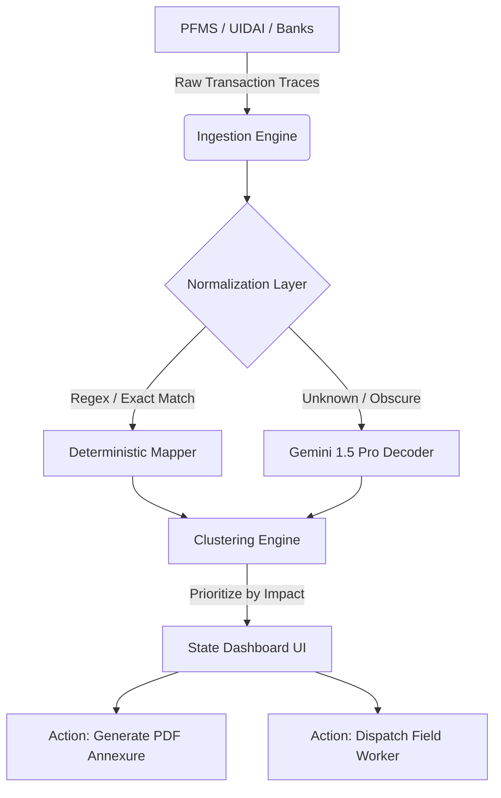

  <h1>🇮🇳 Antim Rupee</h1>
  
  <p><strong>Empowering states to detect, analyze, and resolve stalled welfare payments instantly.</strong></p>

  <p>
    
    
    
    
    
  </p>
</div>

---

## 🚨 The Problem: The "Silent Exclusion"

India’s Digital Public Infrastructure (DPI) processes billions of Direct Benefit Transfers (DBT) annually. However, at the **Last Mile**, nearly **2-4% of transactions fail silently** due to:

- 🧊 **Account Freezes / Dormancy**
- 🔗 **Aadhaar-NPCI Mapping Failures**
- ⏳ **KYC Expiry**
- 📝 **Minor Name Mismatches**

These aren't just data errors; they are **vulnerable citizens dropping out of the safety net.** State agents lack the visibility and tools to resolve these issues proactively before a citizen files a grievance.

---

## 💡 The Solution: Antim Rupee

**Antim Rupee** is an intelligent, high-performance State Dashboard designed to eliminate structural friction in welfare delivery. We ingest raw Bank/PFMS trace logs and use a hybrid **Deterministic + LLM fallback engine** to identify the exact root causes of payment failures, cluster them by branch, and generate actionable worklists for State Agents.

### ✨ Key Features

| Feature | Description |
| :--- | :--- |
| 📊 **The Exclusion Funnel** | Real-time visibility into exact drop-off points in welfare delivery. |
| 🧠 **AI Fallback Decoder** | 91% of traces are mapped deterministically. For the remaining 9% of obscure bank errors (e.g., `REJ_NM_MSMTCH_0XF`), we use **Gemini 1.5 Pro** to translate raw stack traces into actionable plain English. |
| 🖨️ **Automated Batch Annexures** | One-click generation of official PDFs (via `jsPDF`) to send to Bank Branch Managers to unfreeze accounts in bulk. |
| 📱 **"Bharat" Ready (PWA)** | Fully installable as an offline-capable Progressive Web App (PWA) with native Hindi localization (`EN | हिन्दी`) for last-mile agents. |

---

## 🏗 Architecture

Antim Rupee is built as a **4-layer data engine** that transforms raw, messy banking failures into actionable, prioritized worklists for state agents.

1. **Layer 1: Dropout Detection** — Evaluates a 5-condition `silent_exclusion` rule across the worker panel to identify those trapped between a rejected FTO and a non-existent grievance.
2. **Layer 2: Cause Normalization** — Maps raw bank rejection strings into a strict taxonomy of 9 causes using regex, with **Gemini 1.5 Pro** handling the long-tail residuals.
3. **Layer 3: Clustering & Worklist** — Applies a Two-Proportion Z-Test to find significant clusters of failures (by block, by bank, by reason).
4. **Agent Loop** — An automated agent verifies whether "Resolved" clusters resulted in actual FTO credits in the subsequent cycle.



---

## 🚀 Running and Deploying

This project leverages **Framer Motion** for fluid 60fps animations, **Tailwind CSS** for premium styling, **FastAPI** for high-performance routing, and **DuckDB** for lightning-fast OLAP queries.

### 💻 Local Development

**1. Backend (API)**
```bash
cd api
python -m venv venv
source venv/bin/activate  # On Windows: venv\Scripts\activate
pip install -r requirements.txt
# Set your OPENROUTER_API_KEY in .env
uvicorn main:app --reload
```

**2. Frontend (Web)**
```bash
cd web
npm install
# Ensure you have a .env with VITE_API_BASE_URL=http://localhost:8000/api
npm run dev
```

### ☁️ Production Deployment

The repository is fully configured for modern PaaS deployment:

*   **Backend (Render):** Connect this repository to Render and create a **New Blueprint**. The included `render.yaml` is optimized for Render's **Free Tier Web Service**. It provisions the Python environment and automatically runs the AI data generation scripts during the build phase so your DuckDB database is baked into the image.
*   **Frontend (Vercel):** Connect this repository to Vercel. Set the **Root Directory** to `web`. Add the environment variable `VITE_API_BASE_URL` pointing to your Render backend URL. The included `vercel.json` ensures React Router client-side routing works seamlessly.

---

## 🏆 Hackathon Notes

- 🎨 **UI/UX:** We designed this with a premium "Glassmorphism" aesthetic to prove that Government software can look and feel like top-tier enterprise SaaS.
- 📡 **Offline Support:** Switch your browser to Offline mode; the Vite PWA Service Worker will continue to serve the dashboard!
- 📄 **Test the PDF:** Go to the **State Dashboard -> Worklist**, and click **Export Forms** to see the automated annexure generation in action.

<br/>

<div align="center">
  <sub>Built with ❤️ for Bharat.</sub>
</div>
